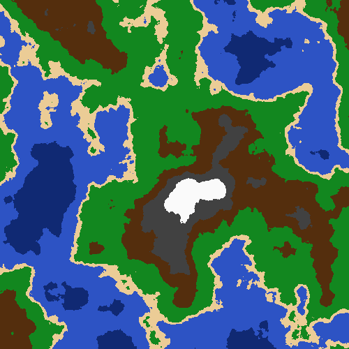

# noise-gen

 This library written fully in Rust generates noise values using the (improved) Perlin Noise algorithm.
 
 The main function uses the library to generate an image of a heightmap colored in to look like an terrain map.

 ### <ins>Example generation (with color added to look like a terrain map)</ins>
 

### Links that were very helpful to understand Perlin Noise and how it works

- https://en.wikipedia.org/wiki/Perlin_noise
- https://www.scratchapixel.com/lessons/procedural-generation-virtual-worlds/perlin-noise-part-2
- https://mzucker.github.io/html/perlin-noise-math-faq.html
- https://rtouti.github.io/graphics/perlin-noise-algorithm
- https://medium.com/@yvanscher/playing-with-perlin-noise-generating-realistic-archipelagos-b59f004d8401
- https://youtu.be/IKB1hWWedMk